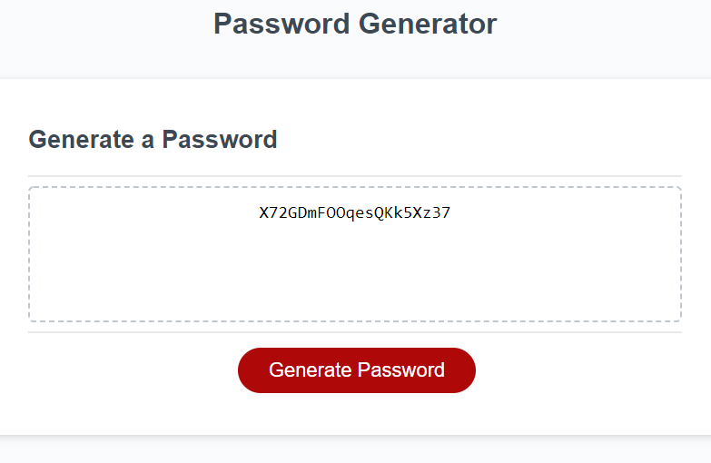

# Portfolio
[Deployed Website](https://sammyk118.github.io/Portfolio/)


This website uses the foundation framework with light JavaScript and jQuery to give information about me and my projects.


Foundation Cards:
```html
 <div class="cell">
          <div class="card" id="card1">
            <h5 id="cardName">Password Generator</h5>
            
          
            <div class="grid-x small-up-2">
              <div class="card" id="butBord">
                <a href="https://sammyk118.github.io/JS-Cool-Password-Generator/" target="_blank" class="button tiny">Site</a>
              </div>
              <div class="card" id="butBord">
                <a href="https://github.com/sammyk118/JS-Cool-Password-Generator" target="_blank" class="button tiny secondary">Github</a>
              </div>
            </div>
          
          </div>
        </div>
      </div>
```
